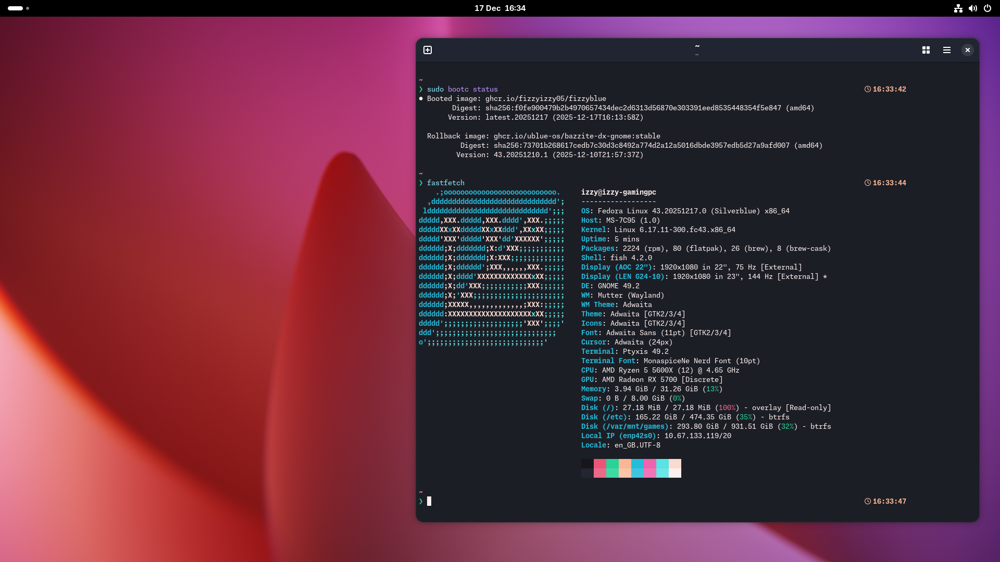

# fizzyblue
fizzyblue is a custom bootc image for desktops and laptops based on Fedora Silverblue. It uses the ublue-os/silverblue-main image as a base with additional software and changes included for a better developer and gaming experience, while retaining a closer to vanilla GNOME. The name "fizzyblue" is an amalgamation of my username + Silverblue.

fizzyblue is a custom image for my own devices, as well as something I can comfortably recommend people close to me to use, but most people should use [Bazzite](https://bazzite.gg) or [Bluefin](https://projectbluefin.io), as they have much larger maintainance teams and communities. That said, if the changes sound appealing to you, please feel free to try it out, but expect limited support compared to a more popular option.

## Screenshot


## Features
- Near-vanilla GNOME experience; minor changes to the default appearance, shortcuts and a few default app substitutions.
    - Firefox (as a flatpak) instead of GNOME Web
    - Bazaar instead of GNOME Software
    - Resources instead of GNOME System Monitor
- Built on the latest release of Fedora.
- Flatpaks are provided through Flathub. Fedora Flatpaks are specifically not included out of the box, due to their poor usability.
- Homebrew pre-installed and automatically updating.
- Visual Studio Code pre-installed. fish and starship included for a better CLI.
- Docker and Podman are both available in the image.
- Steam and Lutris preinstalled for easy access to games, without dealing with Flatpak limitations.
- Additional gaming tools included, such as gamescope, MangoHUD, ProtonPlus and more.
- Fix for the legacy rechunker used by uBlue images for seamless rebasing.

## How to use
### Rebasing
Run this command on an installed bootc system and reboot to use fizzyblue:
```bash
sudo bootc switch --enforce-container-sigpolicy ghcr.io/fizzyizzy05/fizzyblue
```
I recommend coming from a GNOME image, such as Bluefin or Bazzite GNOME. Plasma installs should be fine, but you should install and activate [Mending Wall](https://flathub.org/en/apps/org.indii.mendingwall) before rebasing to minimize conflict between GNOME and KDE settings.
Note that fizzyblue does not have a custom os-release file at this time, and will identify itself as standard Silverblue. This is normal and expected behaviour. 
### Clean installs
Alternatively, ISOs are built on the 1st of the month and are [available for download from GitHub Actions](https://github.com/fizzyizzy05/fizzyblue/actions/workflows/build-iso.yml) for clean installs. Select the latest workflow and download the fizzyblue.iso.zip artifact.

## Credits
fizzyblue is made possible thanks to the work of:
- **Universal Blue**: for providing an image template and base image to build off, Titanoboa for making ISOs, and general inspiration and other parts.
- **Fedora Silverblue**: the ultimate base upon which fizzyblue is built off for packages and software.
- **GNOME**: for providing a great desktop environment to include in fizzyblue.
- And many other projects and individuals!
